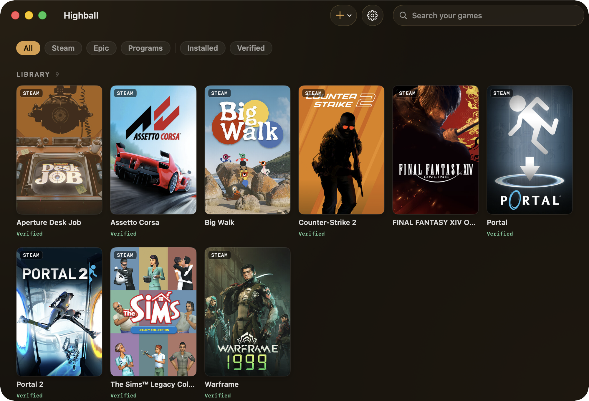

<p align="center"></p>
<h1 align="center">Highball</h1>
<p align="center"><b>Run Windows games on Apple Silicon. Free, open, and never locked to one Wine build.</b></p>

<p align="center">
  <a href="LICENSE"></a>
  <a href="https://github.com/gauthierpiarrette/highball/releases/latest"></a>
  <a href="https://github.com/gauthierpiarrette/highball/actions/workflows/ci.yml"></a>
  <a href="https://github.com/gauthierpiarrette/highball/stargazers"></a>
  
</p>

<p align="center"></p>

Highball is a native macOS app (and CLI) that sets up Wine, DXMT, D3DMetal and DXVK for
you, installs Steam or connects your Epic library, and tells you honestly what runs, what
doesn't, and which renderer to use.

The difference is the data. Every verdict comes from an open, CC0 compatibility database:
verified runs, per-game renderer verdicts, and the kernel-anti-cheat blocklist, with
provenance on every claim. It's a standalone dataset any tool can build on
([highball-db](https://github.com/gauthierpiarrette/highball-db), browsable at
[gethighball.com/database](https://gethighball.com/database/)),
so you can check whether your game runs before downloading a byte.

## Download

### [Download Highball for Apple Silicon (.dmg)](https://github.com/gauthierpiarrette/highball/releases/latest/download/Highball.dmg)

macOS 14+, notarized. Drag it to Applications, open it and press Get started: Highball
installs Rosetta if needed, downloads the engine and prepares a Windows environment, then asks
where your games are (Steam, Epic, or a Windows program you have).

Or with Homebrew:

```sh
brew install --cask gauthierpiarrette/highball/highball
```

Not sure it'll run your game? **[Check the compatibility database →](https://gethighball.com/database/)**

> **Beta, working end to end:** one-button setup → Steam login → game, with the graphics
> mode picked per game from the database and msync-accelerated launches. Auto-updating. Not a paid
> tool and not a thin wrapper: engines are assembled from pinned, SHA-256-verified upstream
> builds, and the compatibility data is public and free for anyone to reuse.

## Will my game run?

That's the whole point of the project, so the answer lives in an open, CC0 database: a
verified renderer verdict, the frame rate people actually got, and provenance on every
claim. Verified runs, community reports and machine-derived predictions are labelled
separately, so you always know which one you're looking at, and it flags kernel-anti-cheat
titles as impossible before you download 80 GB.

### [Search your game in the database →](https://gethighball.com/database/)

Cyberpunk 2077, for one, runs 60–82 fps on an M5 (D3DMetal + FSR 2.1). Renderer switching,
32-bit apps via Wine's WoW64, Windows runtimes, ReShade, and your Epic library via Legendary
work too.

## What doesn't work yet

Several store launchers with an embedded browser (Chromium/CEF) UI don't render under this
Wine build. Rockstar is blocked (it needs a CrossOver-only loader patch), and Ubisoft
Connect and GOG Galaxy don't render a usable login window (Ubisoft stays unpainted, GOG comes
up black), so you can't sign in. Battle.net and
the EA app are flaky. GOG's DRM-free offline installers can be run directly in a bottle,
and Epic works through Legendary. Each case is tracked in the recipe's `knownIssues`.

## Getting started

Requires Apple Silicon and macOS 14+, and prompts for Rosetta 2 if needed.

First run takes a while: the engine download is a few hundred MB, and Steam's first launch
unpacks its own ~235 MB client. Under Rosetta that can take 15 to 25 minutes; the strip at the
bottom of the window shows the step, the elapsed time and the range it usually takes. Let it
finish. If it stalls, relaunch and it resumes.

Everything lives in `~/Library/Application Support/Highball/`. Nothing touches `/usr` or
`/Library`; deleting that folder is a full uninstall.

⌘C / ⌘V / ⌘A work inside Windows apps — the Command keys are mapped to Ctrl, and Option to
Alt so Alt-based game bindings keep working. Turn it off per environment (Settings, then
Environments) for Wine's default, where Command acts as Alt.

<details><summary>Prefer the terminal? The CLI does everything the app does.</summary>

```sh
git clone https://github.com/gauthierpiarrette/highball && cd highball        # the app + CLI
git clone https://github.com/gauthierpiarrette/highball-db ../highball-db     # recipes + game database (CC0)
swift build -c release
.build/release/highball engine install spike/engine-manifest.json
.build/release/highball engine accept x64-sikarugir10.0_6-r0 apple-gptk-license-2023-08-17  # optional: D3DMetal
.build/release/highball bottle create play --recipe steam
.build/release/highball run play Steam
```

Run every command from the `highball` repo root. Recipe and database paths resolve relative
to the current directory, with `highball-db` as a sibling folder.
</details>

Played something? `highball report` files the result to the open database (community reports
already cover M4, M5 and macOS 15). The in-app **Report a Problem** button is for bugs in
Highball itself.

## Why Highball is built this way

This niche has a cautionary tale: [Whisky](https://github.com/Whisky-App/Whisky) was
archived in 2025. Highball is built to avoid the ways these tools tend to die:

- **Engine-agnostic: zero Wine patches, zero hosted binaries.** Engines are assembled from *pinned,
  SHA-256-verified* upstream releases ([Gcenx](https://github.com/Gcenx)'s builds,
  [DXMT](https://github.com/3Shain/dxmt), the
  [Sikarugir](https://github.com/Sikarugir-App/Sikarugir) runtime). An engine update is a
  JSON pull request, not a build pipeline.
- **The database is the product.** Recipes ("Steam needs `sync: none`; this game needs
  DXVK") are versioned CC0 data anyone can use, CrossOver users included. We don't know of
  another machine-readable, CC0 recipe dataset for Wine on Mac.
- **Additive to the ecosystem.** Bugs go upstream, donation links point at Gcenx and DXMT,
  and if you want commercial-grade support you should buy
  [CrossOver](https://www.codeweavers.com/crossover): it's the paid, supported option, and
  it funds most of Wine's Mac work.

## Architecture in one paragraph

`highball` (CLI) and the app are thin views over **HighballKit**: an *engine* is a
manifest-defined bundle (Wine + runtime dylibs + renderer overlays) laid out under
`engines/<id>`; a *bottle* is a `WINEPREFIX` plus `bottle.json`; renderers (WineD3D /
DXMT / D3DMetal / DXVK) are directory overlays selected per launch via
`WINEDLLPATH_PREPEND`; *recipes* are declarative JSON steps (installer, registry,
winetricks, sync, renderer, pin, note) applied to a bottle. D3DMetal is gated behind
explicit acceptance of Apple's Game Porting Toolkit license and is never redistributed in
this repository.

## Contributing

- **Game results**: `highball report <bottle> "<title>" --rating N` opens a pre-filled
  compatibility report on [highball-db](https://github.com/gauthierpiarrette/highball-db);
  accepted ones are folded into `db/reports/` by CI.
- **Bugs in Highball itself**: Highball menu → **Report a Problem** (pre-filled with your
  system info and the log).
- **Recipes**: PRs to [highball-db](https://github.com/gauthierpiarrette/highball-db)
  `recipes/` with the CLI output attached. Every recipe carries `lastVerified` (engine id,
  macOS, chip) so stale data is visible, not silently wrong.
- **Engines**: manifest PRs bumping pinned versions, with a verification note.

## Licensing

App + CLI + HighballKit: **GPL-3.0** ([LICENSE](LICENSE)). Recipes and database:
**CC0-1.0** (in [highball-db](https://github.com/gauthierpiarrette/highball-db)). Wine is
LGPL; DXMT is MIT/LGPL; DXVK is Zlib; D3DMetal is Apple-licensed (non-commercial, downloaded
separately, never modified). Highball has no paid tier and never will: the app is GPL-3.0 and the
data CC0, so anyone can rebuild and redistribute it for free, and a locked paid tier could
never hold.

## Credits

Standing on: [Wine](https://winehq.org) · [Gcenx](https://github.com/Gcenx) (the entire
free Mac Wine supply chain) · [3Shain's DXMT](https://github.com/3Shain/dxmt) ·
[Sikarugir](https://github.com/Sikarugir-App/Sikarugir) · Apple's Game Porting Toolkit ·
[Whisky](https://github.com/Whisky-App/Whisky), whose honesty about its own limits shaped
this design.